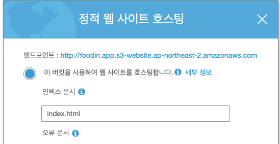
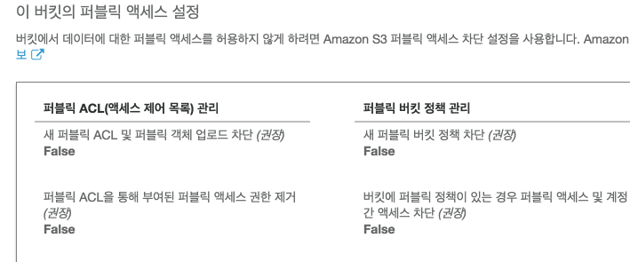
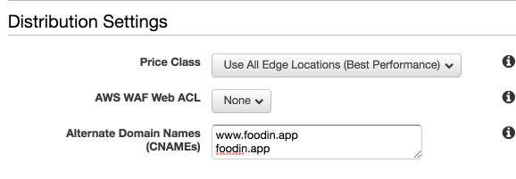

## mydomain.app 이라는 도메인을 사용하는 웹페이지를 aws 에서 만들어보자

.app 은 https 로 자동 리다이렉트되는 도메인입니다. 
https 로 웹페이지를 운영 하려면 단순 s3 웹호스팅이 아닌 cloudfront 까지 적용해야만 합니다. 그리고 route53 으로 연결하는 과정이 필요합니다.
그럼 순서대로 진행해보겠습니다. 저는 미리 사둔 [foodin.app](http://foodin.app) 이라는 도메인으로 시도했습니다.
> 과정 자체는 어렵지 않지만, 중간중간 함정들을 잘 피해가야 정확하게 완료할 수 있음

## <S3 정적 웹 호스팅 하기>

1. 일단 호스팅자체를 위해 s3 를 사용한다.
2. s3 버킷 생성 (내 리전 잘 확인해서 버킷을 생성)
3. 해당 버킷 선택 후, 속성에 가서 정적웹사이트 호스팅 허용

    

4. index.html 파일을 만들어서 해당 버킷에 업로드 
    - 그리고 나면 위 endpoint 로 웹사이트처럼 접속이 가능. 근데 해보면 access denie 가 뜰것이다. s3 권한이 일반유저에게 없기때문이다. 그래서 정책을 추가한다.
5. 정책 넣기 . 모두가 읽을 수 있는 권한 추가.

        {
            "Version": "2012-10-17",
            "Statement": [
                {
                    "Sid": "PublicReadGetObject",
                    "Effect": "Allow",
                    "Principal": "*",
                    "Action": [
                        "s3:GetObject"
                    ],
                    "Resource": [
                        "arn:aws:s3:::foodin.app/*"
                    ]
                }
            ]
        }

    이때, 버킷의 public access 설정 부분이 true 로 되어있으면 정책오류라면서 안된다. false 로 바꾸니 해결.

    

     다 끝났으면, 위 endpoint 를 눌러서 해당 웹서버가 호스팅 잘 되는지 테스트해보자!

## <Cloudfront 생성>

1. https 사용 및 전세계에 빠른 속도로 캐싱된 정적데이터를 뿌려주는 CDN 서비스인 Cloudfront 를 사용
2. create distribution 에 가서 WEB 배포를 선택한다.
3. origin setting
    - 자, origin domain name 에 ~~위에서 만든 버킷을 세팅~~.... **하면 안된다!!!!**

        -da208407-630a-4b65-84c1-791e26f4f728.jpg)

        잘못의 시작..

        - 그동안 이렇게 해서 CF 를 생성하고 배포했었는데, 저 s3 버킷은 말그대로 버킷자체를 cf 로 만든거지, 우리가 올린 정적웹호스팅을 cf 로 만든것이 아니었다!!!
        - 이로 인해서 (이렇게 해도 접속은 되지만) , *기본 index.html 페이지나 404 에러인 error.html 쪽으로 리다이렉트가 안되는 현상이 발생*한다. 이 이유를 찾느라 힘들었다. (아래 참고)

            [CloudFront + S3 Website: "The specified key does not exist" when an implicit index document should be displayed](https://stackoverflow.com/questions/34060394/cloudfront-s3-website-the-specified-key-does-not-exist-when-an-implicit-ind/34065543#34065543)

            **정답은? , 아까 호스팅할때 나온 endpoint 값을 origin domain 에 설정해줘야 한다는 것!**

            > 혹시 이미 s3 로 생성해버렸다면?! (저처럼...ㅜ) 아래처럼 해보자.

            -dec17ef4-ded1-4a8e-9c6f-bf2581f6857b.jpg)

            혹시나 이미 잘못 만들었을 경우, 해당 cf 선택후 설정에 가서 origins and origin groups 에 가서 다시 s3 web endpoint 로 추가해주고, Behaviors 가서 디폴트 캐싱을 새 오리진으로 바꾼 다음. 기존 오리진을 삭제해버리면 된다.

            - 다시 이어서,,, 가장 root 단에 index.html 올리고 호스팅 할 것이므로 딱히 origin path 안 넣어도 된다.
            - HTTP 와 HTTPS 는 호스팅에 맞게 적용해주면 된다.  .app 의 경우 자동으로 https 리다이렉팅이기 때문에 어떻게 하든 상관이 없었다.

4. 그 아래 Distribution 세팅시 CNAMEs 과 ssl 이 중요하다.
    - cname 은 당신이 호스팅할 웹싸이트 주소라고 생각하면 된다.
        - 만약 root 와 서브(아래 예제에선 www) 를 둘다 적용하고 싶으면 엔터로 분리해서 입력해둔다. 1개만 해도 된다.
        - 후에 cname 과 일치하는 도메인만 route53 에서 적용이 가능하므로 정확히 입력

        

    - SSL 인증서는 사실 https 를 안쓰면 불필요하지만, 이 예제는 https 가 필수이므로 꼭 적용해줘야 한다. cname 을 써서 내 도메인으로 배포하려면 커스텀 ssl이 필수
        - 없으면 아래 버튼으로 새로 추가하면 된다. certificate manager 서비스 로 연결된다.

        -cb49626e-89e5-4e81-9065-ce521265b6c5.jpg)

            <Certificate Manager>
            - 적용 내가 적용할 도메인을 *.mydomain.com 등을 사용해서 여러개를 추가할 수 있다.
            - route53 으로 도메인을 관리중이라면, 꼭 DNS 방식으로 인증하길 바란다.
            			(필자 회사는 이메일로 되어있었다가, 만료된 날 대표의 이메일로 인증을 보냈는데, 부재중이어서 서비스가 마비되는 악몽이 있었다)
            - dns 방식 인증은 route53 에서 관리하고 있다면 매우 편하다. 위에 등록과정에서 바로 인증용 cname 을 추가해주면 끝. 수동으로 해도 되지만 aws 가 편하게 추가버튼을 제공해준다.
            - 다 적용하고 나면 인증확인 하는데 5분정도 시간이 걸린다.

        - 완료 되고 나면 다시 SSL 설정하는데 와서 커스텀 선택하고 방금 만든 ssl 선택
        - Default Root Object 를 설정할필요 없다(정적웹호스팅에서 이미 해주었기 때문에!)
        - 완료 하고 배포되길 기다린다.. (오래걸림)

        > 주의 : 이렇게 만든 ssl 인증서는 cloudfront 용도이기 때문에 버지니아 region 으로 만들어진다. 이와 다른 용도 (loadbalancer https 리스너등) 로 쓸때는 해당 리전에서 다시 만들어야 한다는것을 참고하자 (몰라서 계속 헤맸음. 만든거 어디갔지 하고)

## < Route53 >

1. 자 거의 다 왔다!
2. 이미 route53 에 hosted zone 을 도메인에 맞게 생성해놨다는 가정하에 진행. 모르면 아래링크!
3. cloudfront 가 status : Deployed 상태가 되고 나면 이제 레코드로 사용이 가능하다. 새 레코드를 추가해서 아래와 같이 해보자.

    -83e70adf-b791-46d0-a3dc-7de8117ee2fe.jpg)

4. 아까 만든 cloudfront 에 www 와 root 를 만들었기 때문에 저렇게 www.도메인을 입력하면 alias target 에 나타난다. (test.도메인 처럼 다른걸 입력하면 목록에서 cf 가 안보인다!)
선택하고 생성해준다.
5. 잠시 뒤 부터 해당 경로를 이용해서 web 서버에 접속이 가능해진다.
6. 루트페이지인 index.html 이나 에러페이지에도 모두 잘 들어가지는것을 확인.

> 이제 당신만의 웹페이지가 탄생했습니다. 무려 https 도 가능합니다!!
